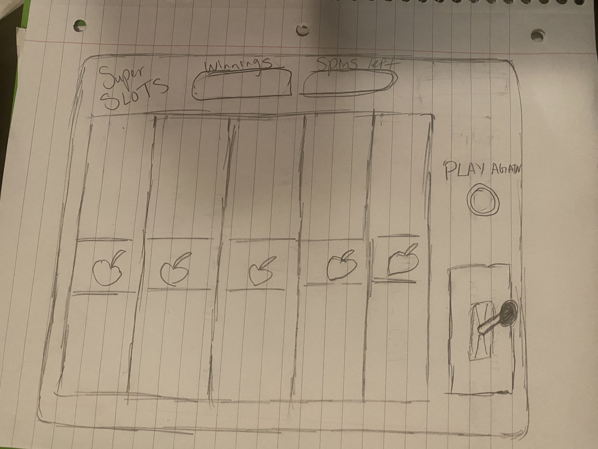

# SLOTS
Hello fellow Gamblers,  
The Game Slots, is a Slots-machine where you put leave your money up to chance. Whether you win or lose, who know. Give your luck a try with a press of a button.   
To play slots 'click' the button called switch, then wait 2.5 secs for your prize to render. Realistically you can't lose money.  
Remember you only have 5 turns so make them count and pray! After 5 turn you'll be presented with a grand total and an option to play agian. Are you willing to try again?

# Screenshot

## Technologies Used

- JavaScript
- HTML
- CSS

## Getting Started
"https://jesusi3.github.io/slots/"
- for instructions on how to play refer to the intro 

## Next Steps
Ice box Items that i'd liked to include would be ... 
- An up and down down joystick! 
- A slot spin animation! 

## Honoray Mention
- Kenneth & Mario(Polished my code) 
- Andrew & Zachary(walked me through bugs)
